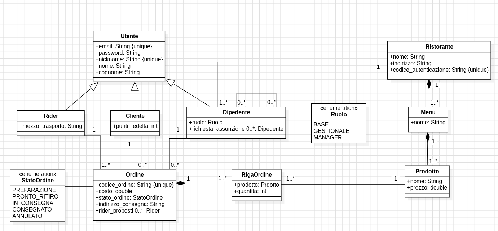

## Documentazione(Markdown)

Il dominio scelto è quello della **ristorazione e della consegna a domicilio**. L'applicazione si
pone come intermediaria tra i ristoratori, i clienti finali e i rider incaricati della consegna,
orchestrando l'intero ciclo di vita di un ordine — dalla consultazione del menù fino alla
conferma della consegna

l'applicazzizzione supporta tre macro-categorie di utenti , ciascuno con ruoli è responsabilità diverse, i clienti che esplorano i ristoranti e i loro menu ed effettuano degli ordini, i dipendenti del ristorante ogni uno con ruoli e permessi diversi, rider responsabili di ritirare l'ordine effettuato dal cliente e della sua consegna

---

**CLIENTE**
agli utenti non registrati  gli sara richiesto di effettuare il login , per poter diventare **cliente** ed effettuare gli ordini, fornendo email , password , nickname , nome e cognome , clienti potranno sfogliare i ristoranti e i loro menu con i loro prodotti disponibili, effettuando ordini sopra i 20 euro sulla piattaforma accumelando punti fedeltà alla piattaforma con il quale potranno avere uno sconto su un prodotto aquistato

**DIPEDENTE** 
gli utenti potranno registrasti anche i loro ristoranti alla piattaforma aquisendo  il ruolo aggiuntivo da **dipedente** della piattaforma , non appena registrato il ristorante l'utente che la creato ottera il ruolo del **manager** e sara l'unico dipendete ad avere questo ruolo , verrà generato anche un codice di autenticazione con il quale altri utenti potranno richiede diventare dipedenti del ristorante, se accettati avranno il ruolo base con il quale potranno semplicemente  creare gli ordini e accettare i rider per la consegnare del'ordine , mentre i dipendenti promossi al ruolo **gestionale** avranno la possibilità di poter anche loro come il maneger effettuare delle modifichie al ristorante al suo menu e ai suoi prodotti , e di poter accettare gli utenti come dipedenti del risotante

(schema dei permessi in base al ruolo)
(ruolo ↓ )(operazione  →)

| RUOLO      | Aggiornare lo stato del'ordine | Accettare degli utenti come dipendenti del ristorante | Creare/Modificare/Cancellare Ristorante, Menu e Prodotto | Modificare il ruolo dei dipedenti e cancellare il ristorante |
| :--------- | ------------------------------ | ----------------------------------------------------- | -------------------------------------------------------- |--------------------------------------------------------------|
| BASE       | SI                             | NO                                                    | NO                                                       | NO                                                           |
| GESTIONALE | SI                             | SI                                                    | SI                                                       | NO                                                           |
| MANAGER    | SI                             | SI                                                    | SI                                                       | SI                                                           |

**RIDER** 
gli utenti che si registranno come rider dovranno specificare il loro mezzo di trasporto con il quale effettuerano le consegne, puo visualizzare gli ordini che sono in **fase di preparazione disponibili** per la consegna e **proporsi come rider**, se accettato dal dipedente del ristorante potra effettuare il ritiro del'ordine non appena disponibile 

(tabella di transizione degli stati degli ordini)

| Stato                | Descrizione                                                                                                                                                                                             | Come ci si entra                                                                                                                             | Come ci si esce                                                                                                                                                                                                 |
| -------------------- |---------------------------------------------------------------------------------------------------------------------------------------------------------------------------------------------------------|----------------------------------------------------------------------------------------------------------------------------------------------|-----------------------------------------------------------------------------------------------------------------------------------------------------------------------------------------------------------------|
| Preparazione         | L'ordine è stato confermato dal cliente ed è in attesa di essere preparato dal ristorante.  Stato iniziale dell'ordine; visibile ai rider disponibili nella piattaforma.                          | Il cliente conferma il proprio ordine e il sistema lo crea automaticamente in questo stato.                                                  | → **Pronto per il ritiro**: un dipendente del ristorante segna l'ordine come pronto tramite l'applicazione.  → **Annullato**: il cliente  o ristorante cancella l'ordine prima che venga preso in carico. |
| Pronto per il ritiro | L'ordine è pronto e in attesa che un rider si presenti per il ritiro presso il ristorante.  Un rider ha accettato la consegna; il ristorante è in attesa del suo arrivo.                          | Un dipendente del ristorante (ruolo Base o superiore) segna l'ordine come pronto nell'app.                                                   | → **In consegna**: il rider conferma il ritiro fisico   → **Annullato**: il cliente  o ristorante cancella l'ordine prima che venga ritirato dal rider.                                                   |
| In consegna          | L'ordine è stato ritirato ed è in transito verso l'indirizzo di consegna indicato nell'ordine.                                                                                                          | il rider conferma la presa in carico                                                                                                         | → **Consegnato**: il cliente conferma la ricezione dell'ordine tramite l'applicazione.                                                                                                                          |
| Consegnato           | L'ordine è stato consegnato con successo al cliente. Stato terminale.  I punti fedeltà vengono accreditati al cliente al raggiungimento di questo stato (se rispettano le condizioni neccessarie) | Il cliente conferma la ricezione dell'ordine nell'applicazione.                                                                              | Stato finale — nessuna transizione ulteriore possibile.                                                                                                                                                         |
| Annullato            | L'ordine è stato cancellato e non verrà consegnato. Stato terminale.  Non è possibile annullare un ordine già in stato _In consegna_ o _Consegnato_.                                              | • Il cliente cancella l'ordine (solo da stato _Preparazione_).  • Il dipendente puo annulare il ritiro (solo da stato _Preparazione_). | Stato finale — nessuna transizione ulteriore possibile.                                                                                                                                                         |

---
### Vincoli di Buisness

- la quantita di ogni riga d'ordine deve essere  maggiore di zero
- un ordine può contenere prodotti appartenti ad unico ristorante
- il codice di autenticazione di un ristorante deve essere univoco
- il codice di un ordine deve essere univoco
- si guadagna un punto fedeltà con gli ordini maggiori uguali di 20 euro , con un limite massimo dello sconto del 15%

Documentazione by DE1000319 (tiziano)
